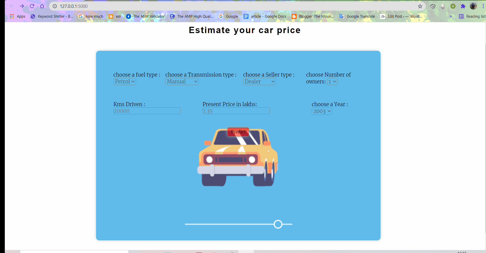

# Car Price Prediction : 

This a simple car price prediction model that I build for demonstration purpose to the GDSC members. 

I found the dataset on Kaggle, I took a lot of techniques from kaggle notebooks to build the model and deployed the model using flask. 

For the front-end I have used <b>HTML and CSS<b> 

This is how it looks and works 

    

To build this project I have reffered to the following videos on YouTube : 

* [Siddhardhan](https://www.youtube.com/watch?v=L3OtLaCbJC8)
* [Krish Naik](https://www.youtube.com/watch?v=L3OtLaCbJC8)

# If you Liked this project the you can consider connecting with me:
* [LinkedIn](https://www.linkedin.com/in/soumyadip-ghorai/) 

* You can find my other projects and EDAs on [Kaggle](https://www.kaggle.com/soumyadipghorai)

